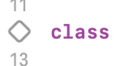

# Intercom
## Mobile Engineer - iOS assignment test

### Invitation App

**To run the application:**

- User must have an iPhone or a simulator with iOS version 13.5.
- Open the project in XCode conect you iPhone or choose a simulator, than run the app.
- Click at the button   to see the list of customers within 100Km from Intercom office.

**To test the application:**

- Open the project in XCode do not run the application.
- Click at InvitationTests.swift file.
- There are two functions to test whether customer is near of far from the office.
- To test each one individually click at the button on the left of the func declaration. 
- 
- To test all functionalities click at the button on the left of the class declaration. 
- 
